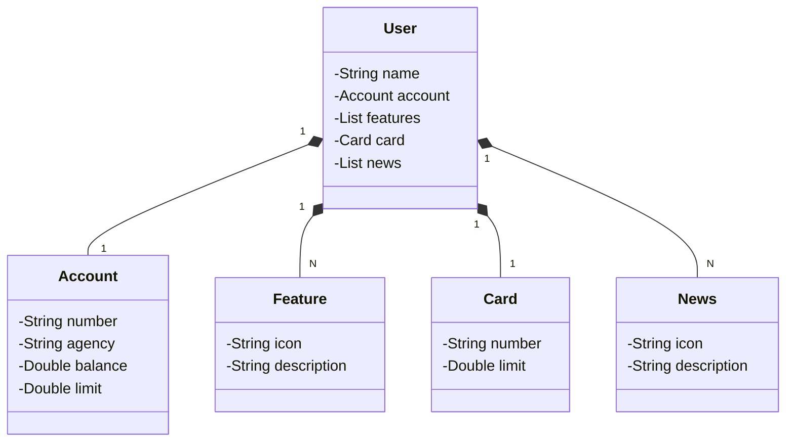

# API

### Diagrama de Classes

```mermaid
classDiagram
class User {
  -String name
  -Account account
  -List<Feature> features
  -Card card
  -List<News> news
}

class Account {
  -String number
  -String agency
  -Double balance
  -Double limit
}

class Feature {
  -String icon
  -String description
}

class Card {
  -String number
  -Double limit
}

class News {
  -String icon
  -String description
}

User "1" *-- "1" Account
User "1" *-- "N" Feature
User "1" *-- "1" Card
User "1" *-- "N" News
```
